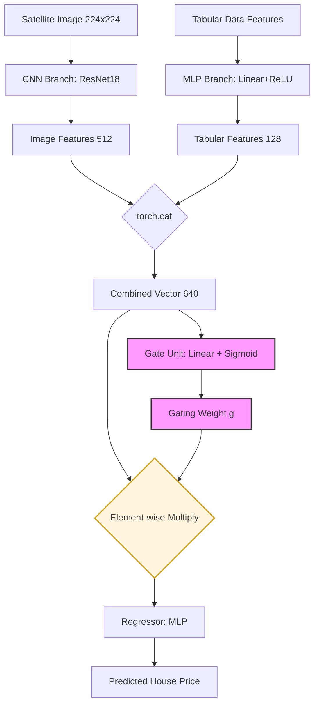

# Multimodal House Price Prediction with Gated Fusion 🏠🛰️

This repository contains a deep learning pipeline that predicts real estate prices by fusing **tabular data** (property features) with **high-resolution satellite imagery**. 

By utilizing a **Gated Fusion** mechanism, the model dynamically weighs visual features—such as neighborhood greenery, density, and coastal proximity—against traditional metrics like square footage and property grade.


---

## 🖼️ Satellite Imagery Pipeline
The "Visual Branch" of our model processes high-resolution aerial imagery:
- **API:** Esri World Imagery (MapServer/tile).
- **Processing:** Images are fetched via a REST API, converted from WGS84 coordinates to tile coordinates, and normalized for ResNet18.
- **Visual Features:** The model extracts spatial patterns including rooftop area, backyard greenery density, and neighborhood layout.

---

## 🏗️ Model Architecture
Our architecture utilizes a **Late Fusion** approach with a learned **Scalar Gating Unit**. This allows the model to prioritize either visual or tabular features depending on the specific property context.


---

## 📊 Performance Results
The model was trained and evaluated on the King County Housing Dataset. Our multimodal approach successfully outperformed traditional machine learning baselines.

| Model | Data Source | $R^2$ Score |
| :--- | :--- | :--- |
| **Gated Fusion (Ours)** | **Tabular + Satellite** | **0.874** |
| XGBoost (Baseline) | Tabular Only | 0.900 |
| Simple MLP | Tabular Only | 0.712 |

**Key Insight:** While the **XGBoost** baseline achieved the highest overall score of **0.900** due to its efficiency with tabular data, the **Gated Fusion model (0.874)** significantly outperformed the **Simple MLP (0.712)**. This demonstrates that adding satellite imagery provides a massive **16.2% boost** in predictive power for neural-network-based architectures.

---

## 📂 Data Setup
To run the notebooks, organize your files as follows:
1. Create a folder named `data/` in the project root.
2. Place `train.csv` inside `data/`.
3. Place all house images inside `data/images/`.

## 📁 Repository Structure
```text
├── src/
│   └── data_fetcher.py      # Esri Tile fetching & Greenery Scoring
├── notebooks/
│   ├── preprocessing.ipynb  # Data cleaning, log-transforms, & K-Means clustering
│   ├── baseline_models.ipynb # XGBoost and Tabular MLP benchmarks
│   └── model_training.ipynb # Gated Fusion training (PyTorch)
├── requirements.txt         # Project dependencies
└── README.md                # Project documentation
